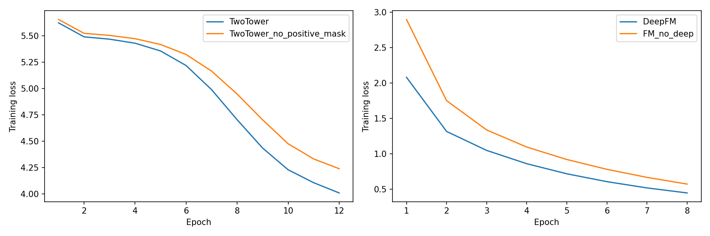
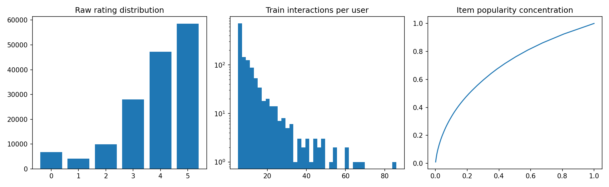

# BookRec · Goodreads 图书推荐系统

真实 Goodreads 诗歌数据、CPU 实验、PyTorch 双塔 InfoNCE、FAISS Top-K、DeepFM、FastAPI 与网页展示。完整技术报告包含 60 个面试追问、数学推导、所有超参数、实际结果与局限。

## 本次运行

- 原始评论：154,555；训练正反馈：12,436。
- 训练目录：1,267 用户 / 984 图书；评分 ≥4，训练 5-Core。
- 全局时间切分，warm-only 排名评估；冷启动过滤数见技术报告。
- Python 3.13.5 / CPU / seed 42。

|模型|Recall@10|HitRate@10|NDCG@10|Recall@20|HitRate@20|NDCG@20|users|
|---|---:|---:|---:|---:|---:|---:|---:|
|Popularity|0.023333|0.033333|0.011985|0.045556|0.073333|0.018183|150|
|ItemCF|0.077778|0.106667|0.046083|0.170833|0.233333|0.072190|150|
|TwoTower|0.013556|0.026667|0.006093|0.048556|0.066667|0.015061|150|
|TwoTower_no_positive_mask|0.035000|0.046667|0.017499|0.056333|0.080000|0.023284|150|
|TwoTower_FAISS_DeepFM|0.050000|0.066667|0.024420|0.063056|0.093333|0.028435|150|

|模型|AUC|LogLoss|samples|positive_rate|
|---|---:|---:|---:|---:|
|DeepFM|0.526246|0.472899|23000|0.010000|
|FM_no_deep|0.523751|0.659245|23000|0.010000|

本次测试 NDCG@20 最高的是 **ItemCF**。主双塔 NDCG@20=0.015061，未屏蔽训练正例的消融=0.023284；端到端 FAISS+DeepFM=0.028435，相对双塔绝对差=+0.013374。这些是单 seed 实测，不能外推成普遍提升。若精排退化，首先检查均匀负例与召回候选分布偏移，而不是用较高 AUC 替代端到端评价。

## 运行

建议 Python 3.13。首次运行下载官方数据、安装依赖并训练，需网络。

```powershell
powershell -ExecutionPolicy Bypass -File .\run.ps1 -Serve
```

```bash
bash run.sh --serve
```

已有环境和模型时，直接启动服务：

```bash
python -m uvicorn bookrec.api:app --host 127.0.0.1 --port 8000
```

浏览器打开 http://127.0.0.1:8000；API 示例 `/recommend?user_id=0&k=10`；交互接口文档 `/docs`。user_id 为内部编号，合法范围 0–1266，更大编号走热门兜底。

手动复现：

```bash
python -m pip install -r requirements.txt
python -m bookrec.pipeline
python -m pytest -q
python scripts/build_report.py
```

## 项目结构与证据

- [技术报告](docs/TECHNICAL_REPORT.md)：数据、EDA、架构、公式、训练、实验、风险、A/B 方案、60 问。
- [配置](configs/default.json) / [依赖](requirements.txt) / [测试](tests/)。
- [真实指标](artifacts/metrics.json) / [对比 CSV](artifacts/comparison.csv) / [训练日志](artifacts/training_log.csv)。
- [训练耗时与选模](artifacts/training_summary.json) / [环境](artifacts/environment.json) / [源文件指纹](artifacts/data_manifest.json)。
- 本地 `artifacts/` 包含 checkpoint、FAISS、向量、固定精排样本；Git 忽略模型与原始/处理数据，克隆后需重建。
- 每次运行覆盖结果；多实验请先保存当前 artifacts，报告由实际结果自动生成。




## 诚实边界与后续迭代

FAISS 使用精确 FlatIP，并非 ANN；AUC/LogLoss 为采样负例协议，不是实际点击率；没有线上 A/B 或生产部署。warm-only、诗歌体裁、单 seed 和 ID-only 是主要局限。优先做训练内难负例、内容特征、多 seed/时间回测，再扩展 ANN 与线上实验。

数据来自 [UCSD Book Graph](https://mcauleylab.ucsd.edu/public_datasets/gdrive/goodreads/UCSD%20Book%20Graph.html)，使用条件由数据源决定，项目代码许可不覆盖源数据。
