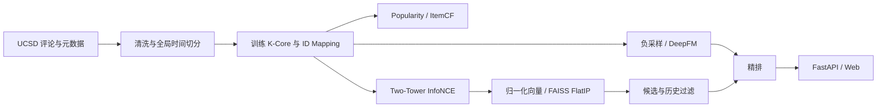

# BookRec 技术报告

## 1. 项目背景与业务目标

BookRec 是一个基于 Goodreads 诗歌评论的图书推荐求职项目。目标是提供可以本地复现的“数据处理—召回—精排—服务”闭环。业务场景是图书发现页：用户提交内部编号，系统过滤训练历史，召回候选图书，再预测相对偏好并排序。未知编号走热门兜底。本项目没有真实流量、曝光日志、点击日志或商业转化数据，不能声称提升 CTR、收入或用户留存。

离线目标包括提高用户级 Recall、HitRate、NDCG，并观察目录覆盖与平均推荐热度。线上目标设计为有效阅读/收藏率，点击率作为辅助指标，延迟、投诉、重复推荐率作为护栏。当前交付为可运行研究原型，真实训练结果在下文自动填充。高评分评论是偏好代理，不能等同于阅读完成或点击。

## 2. 数据来源、选择与数据契约

使用 UCSD Book Graph 官方 `goodreads_reviews_poetry.json.gz` 和 `goodreads_books_poetry.json.gz`。选择按体裁划分的 Goodreads 公开子集，保留图书业务语义与真实时间字段，同时避免全量数 GB 到数十 GB 数据的下载和训练成本。没有用合成数据替代实验。源地址、实际字节数、SHA256 在 `artifacts/data_manifest.json`；下载器先写临时文件，完成后改名，已有文件直接复用。现有文件的完整 gzip 解码会暴露截断问题；SHA256 是本次下载指纹，并非站方签名。

原始评论读取 `user_id, book_id, rating, date_added`，不使用评论正文。`date_added` 表示记录加入 Goodreads 的时间，不能假设它是实际读完时间。UTC 解析失败的记录剔除；用户—书籍重复记录保留最早一条，再保留评分 ≥4 的正反馈。0 分不解释成不喜欢。元数据仅用于展示标题及作者 ID，不使用站方全量平均分、评价次数等可能包含未来信息的字段训练。作者姓名解析未实现。

使用全体清洗正反馈时间的 80% 与 90% 分位点设定两个全局边界，训练 `<t1`、验证 `[t1,t2)`、测试 `>=t2`。这是离线确定边界的回溯实验；实际生产应在实验前固定日期。重复 pair 已全局去重，因此各集合不重叠，同一用户多次消费同书不是当前目标。严格边界避免同一时间戳跨集合。

只对训练段迭代进行用户与物品 5-Core：同时删除交互数不足 5 的节点，直到不再变化。先切分后 K-Core，避免未来活跃度决定训练用户保留。对训练留下的原始字符串 ID 按字典序生成从 0 开始的连续映射，保存到 `data/processed/mapping.json`。验证/测试主指标只包含训练已知用户与图书；完整冷启动过滤计数同时保存，这些主指标不能外推到全体新用户。

### 实际 EDA 与切分

{{EDA}}

评分图描述原始评分分布；训练用户频次图采用对数纵轴；热门集中度图按物品训练频次从高到低累积。密度是训练正反馈数除以用户数与书籍数乘积；top 1% share 使用 `max(1, floor(items/100))` 本热门书的训练交互占比。单一诗歌体裁与留下的活跃用户形成选择偏差。

## 3. 系统架构与代码导航

|文件|职责|
|---|---|
|`bookrec/data.py`|流式下载、gzip 逐行读取、时间清洗、训练 K-Core、映射、负采样|
|`bookrec/models.py`|双塔和共享 embedding 的 DeepFM/FM|
|`bookrec/metrics.py`|用户级多正例排名指标、目录覆盖、平均热度|
|`bookrec/pipeline.py`|训练、验证选模、基线、消融、全目录评估、索引、曲线与环境记录|
|`bookrec/api.py`|启动加载模型、冷启动、过滤历史、召回与排序|
|`bookrec/web.html`|同源网页、状态反馈、图书卡片、错误显示|
|`configs/default.json`|所有实验配置的入口|
|`tests/`|指标手算、级联剪枝、负采样、梯度、时间隔离、FAISS 与 API 集成验证|
|`scripts/build_report.py`|从实际 JSON/CSV 生成本报告和 README|

## 4. 算法数学原理与对应实现

### 4.1 Popularity

训练正反馈计数 `p_i=Σ_u R_ui`，对所有用户给出相同顺序，再过滤其训练历史。其优点是简单、稳定、可解释并可覆盖新用户；缺点是缺少个性化，放大热门偏置。本项目不使用验证/测试反馈更新热门度。

### 4.2 ItemCF

训练稀疏二值矩阵 `R∈{0,1}^{U×I}`，共现为 `C=RᵀR`，相似度 `s_ij=C_ij/sqrt(p_i p_j)`，对角线置零。用户分数 `score(u,j)=Σ_{i∈H_u}s_ij`。当前对所有已读书求和，没有额外近邻截断、收缩或时间衰减。保存稀疏交互，但相似度转为稠密矩阵，空间 O(I²)，这适用于当前小目录，不适合百万书籍。扩展时应分块计算并只保留每行 top neighbors。

### 4.3 Two-Tower

用户和物品各自一个 ID embedding，经过 `Linear(d,d) → ReLU → Linear(d,d)`，最后 L2 归一化。没有使用标题文本或用户画像特征，因此新 ID 不能由该模型独立生成有效表示。归一化后内积等于余弦相似度，便于离线索引。

批内正 pair `(u_b,i_b)`，打分 `z_bj=q(u_b)ᵀv(i_j)/τ`。损失为 `L=−(1/B)Σ_b log[exp(z_bb)/Σ_{j∈A_b}exp(z_bj)]`。`A_b` 始终保留对角正例；其余位置若对应物品已在该用户训练正例集合则屏蔽为 −1e9，避免重复物品和同用户其他正反馈充当假负例。未屏蔽版本用于消融。没有读取验证/测试正例进行训练屏蔽，也没有 log-Q 校正，因此批内采样仍偏向训练热门物品。

用交叉熵稳定计算 InfoNCE，不手工直接指数求和。用户和物品都有可训练 MLP；这不是只有内积的矩阵分解。CPU、固定 seed、确定性算法、固定线程；不同平台或库版本的浮点结果仍可能略有差别。

### 4.4 DeepFM 与 FM 消融

三个离散字段：用户 ID、物品 ID、训练热门度桶。桶 `min(9,floor(9·log(1+p_i)/max_j log(1+p_j)))`，只使用训练统计。每个字段独立 embedding 表，同一组 embedding 同时送入 FM 与 DNN。输出 logit：

`z = b + Σ_f w_f(x_f) + 1/2 Σ_d[(Σ_f e_fd)² − Σ_f e_fd²] + MLP(concat(e_1,e_2,e_3))`。

DNN 隐层 64、32，ReLU，输出 1。sigmoid 得到采样分布下的正反馈分数。损失为 `−mean[y log σ(z)+(1−y)log(1−σ(z))]`，实现用 BCEWithLogits 避免数值不稳定。FM 消融保留一阶项及二阶交互，关闭 DNN；其参数对象仍含 MLP，但前向不使用，故不更新这部分权重。无 dropout、batch normalization、学习率调度、预训练或类别重权重。

## 5. 样本构造与评估协议

训练 DeepFM 每个正例均匀无放回采样最多 4 个目录物品，排除该用户全部训练正例。每个正例内部无重复负例，不同正例之间允许重复。未来喜欢但训练时未见的书可能成为负例，这是隐反馈的不可观测性，并没有用未来标签回避它。训练样本固定一次，不逐 epoch 重采样。

验证/测试分类协议为每正例最多 99 个均匀负例，排除训练历史与当前被评估集合中该用户的全部正例。验证样本不使用测试正例集合。分类样本保存在 `ranking_samples.npz`，保证 DeepFM 与 FM 对比使用相同 pair；正率是采样产生的，不能解释为线上 CTR，AUC 也受负采样难度影响。分类指标按 pair 加权，交互更多的用户贡献更多。

排名主评估对每个有 warm 正例的用户，把该时间段所有正例作为一个集合，对训练目录所有物品排序，屏蔽训练历史。验证结束后没有把验证反馈加入用户历史或更新模型；测试评估冻结在训练截止时点的系统，这与在线滚动更新不同。这个约定同时用于所有 baseline 与端到端评估。

`Recall@K=|TopK∩T_u|/|T_u|`；`HitRate@K=1[TopK∩T_u≠∅]`；`DCG@K=Σ_{r=1}^K rel_r/log2(r+1)`，`NDCG=DCG/IDCG`。先每用户计算，再对用户平均；多正例时 Recall 与 HitRate 不等价。没有正例的用户不进入主排名评估。AUC 用正负 pair 分数计算，LogLoss 使用 sklearn 的概率裁剪。

双塔召回 candidate_k=100，先多取历史数量再过滤，截取 100 个供 DeepFM 排序。端到端指标衡量最终 top10/20 对测试正例的命中；另存候选 Recall@100，它构成精排 Recall 的上限。Coverage 为所有推荐过的不同书籍数/训练目录数；MeanPopularity 为所有返回位置对应物品的训练计数均值。Coverage 是跨用户目录覆盖，不能替代列表内语义多样性。

## 6. 超参数、训练环境和真实结果

双塔 Adam，验证 NDCG@20 最大的 epoch 存储；DeepFM/FM Adam，验证 LogLoss 最小的 epoch 存储。始终跑满配置 epoch 再加载最佳 checkpoint，不是提前结束训练。并列时保留第一次。测试指标在每个模型选定后计算，不参与 checkpoint 选择。固定 batch shuffle；最后不足一个 batch 的样本保留。

{{CONFIG}}

{{ENV}}

{{SUMMARY}}

{{RESULTS}}

{{INTERPRETATION}}

完整逐 epoch 日志为 `artifacts/training_log.csv`，包含训练 Loss 与用于选模的验证指标。`metrics.json` 同时保留验证和测试结果；`comparison.csv` 为测试对照表。每次运行会覆盖当前 artifacts，比较多次试验时应复制整个结果目录或使用独立 checkout。目前仅一个随机种子的对比，不能据此宣布统计显著或泛化优势；没有未运行的“预计指标”。

## 7. FAISS、在线离线一致性与服务

采用 `IndexFlatIP` 精确检索，float32、L2 归一化。该索引不需要训练，空间约 `4Id` 字节向量存储、单次搜索 O(Id)；它是精确全扫描，不是 ANN。FAISS ID 直接对应连续 item ID。训练结束写入 `books.faiss`，用户/物品向量与模型 checkpoint 同版本保存；测试与 NumPy 内积 topK 比较。

在线服务启动一次加载索引、缓存用户向量、DeepFM 和训练历史。每次请求：校验参数 → 判断冷启动 → FAISS 多取候选 → 剔除历史 → 精排 → 返回标题与分数。索引/模型不在每次请求重新加载。所有 book 标题用网页 `textContent` 渲染，避免把数据里的 HTML 当作页面代码执行。`user_id` 是内部演示 ID，不是生产身份鉴权。

`GET /health` 返回加载后的目录规模；`GET /recommend?user_id=0&k=10` 返回 item_id、Goodreads book_id、标题、作者原始元数据与分数；`GET /` 展示网页；`/docs` 是 FastAPI API 文档。k 限定 1–50，负 user_id 拒绝，超过训练范围用户采用热门兜底。没有公网部署、数据库、实时事件写入、限流、认证或服务 SLA。

实际延迟在 summary 中，是前 200 个（或不足 200 时全部）训练用户的单进程串行暖查询：候选召回与模型前向，包含张量构造，不含网络、序列化和浏览器绘制。它不能作为线上 P95 或 QPS 承诺。训练耗时字段中 baseline 包括验证/测试，神经模型包括训练和周期验证；total 包含下载检查、数据预处理、负采样和其他评估，到 summary 写入前为止，不含图表与文档生成。

扩大规模时比较 IVF 的 nlist/nprobe 或 HNSW 的 M/efSearch，并以 FlatIP 为真值报告 ANN recall、延迟、内存。当前未执行这些近似索引实验。部署中应以版本清单绑定 mapping、特征统计、塔模型、用户向量、物品向量、FAISS 与 ranker；新版本在后台构建并检查后原子切换，保留上一版本回滚。

## 8. 冷启动、偏置、多样性与性能瓶颈

新用户当前返回热门书；可迭代为显式选择喜爱作者/体裁、短会话历史与内容塔。新书无训练 ID，不进入当前目录，不能声称已解决新书冷启动。下一步可用标题/简介/作者等仅在当时可用的信息生成内容向量，并引入探索流量。低活跃用户由 K-Core 排除，应另建冷/长尾人群评估。

热门偏置来源包括评分意愿、曝光选择、K-Core、批内频率负采样和均匀精排负采样。当前记录 Coverage 与 MeanPopularity，但不主动去热门。后续可试 log-Q、混合热门与难负例、逆倾向校正、重排热度惩罚；缺少曝光 propensity 时不能把离线分数称为无偏估计。多样性可采用 MMR：`λ relevance − (1−λ) max similarity`，并检查作者重复、列表内距离、新颖性和主指标折损；当前没有实现 MMR 或假称其效果。

主要瓶颈：ItemCF O(I²) 稠密相似矩阵；当前双塔屏蔽在 Python 构造 B² membership，扩展应向量化稀疏 membership；分类评估每正例 99 negatives，内存随正例数增长；负采样逐用户事件构造目录差集；API 单进程并设置 PyTorch 线程，多进程可能造成 CPU 过度订阅。生产应预计算候选、批量推理、分层缓存、控制线程与 worker，并压测热点和冷用户。

## 9. 局限性与下一步实验

本项目只有诗歌体裁、历史评分、一个随机种子、小规模 ID 特征；没有真实曝光负例、用户人口属性、文本塔、会话模型或因果分析。评论记录加入时间并非完整行为时间，且全局首次 pair 保留会抹去偏好变化。warm-only 主表的覆盖限制由 EDA 显示。高离线 AUC 不意味着好的 end-to-end 推荐；精排在均匀负样本训练、却在双塔难候选上推理，存在分布偏移。

优先迭代：加入训练内切分生成的 out-of-fold 召回难负例，与均匀负例混合；增加内容字段并建立新书评估；运行 3–5 个 seed 并做用户级 bootstrap 置信区间；增加滚动日期回测；对照最强基线而非只对比弱模型；评估用户活跃度、头尾书籍、人群覆盖；最后才扩大数据和 ANN。任何改进都应重新运行并保留旧结果，不能修改文档数字代替实验。

## 10. 线上 A/B Test 设计（方案，未执行）

首先验证埋点：request_id、匿名 user_id、实验分组、模型/索引版本、候选来源、展示位置、曝光、点击、收藏、有效阅读时间和事件时间。随机按用户稳定 hash 分桶，避免一个用户跨组；控制组采用离线最强且可服务的基线，实验组为待验证管线。先 A/A 排查分流比例、丢事件与 SRM，再小流量逐步扩大。

事先指定主指标“有曝光用户的有效阅读转化率”，明确定义有效阅读阈值和归因窗口；辅助 CTR、收藏率、目录覆盖；护栏 P95 延迟、错误率、重复书、退出率。样本量用基准比例 p、最小可检测差 δ、显著性水平与 power 估算，例如每组约 `2(z_alpha/2+z_beta)^2 p(1−p)/δ²`，p 与 δ 必须来自实际产品数据，不在本报告编造。用户为统计单位，考虑重复测量和周周期；运行长度和停止条件预先确定，不能反复看显著性择时停止。对多指标做校正并排查新奇效应；失败回滚记录版本与原因。

## 11. 高频面试追问与标准回答

{{QA}}

## 12. 复现、审计与引用

Windows：在项目根执行 `powershell -ExecutionPolicy Bypass -File .\run.ps1 -Serve`。Linux/macOS：`bash run.sh --serve`。脚本建立独立环境、装依赖、下载或复用原始文件、训练、测试、生成文档，最后启动本地网页。首次需要网络访问官方数据站与 Python 包源。手工步骤见 README。Python 包版本以实际 `environment.json` 为准，requirements 由报告脚本同步锁定直接依赖；Python 3.13 是本次验证版本。

源数据不入 Git，处理后的原始用户映射不入 Git，模型大文件不入 Git；本地交付目录包含实际文件，可直接启动服务。公共仓库克隆后需要一键重建，不意味着 Git 中已经含可直接服务的模型。项目代码许可与源数据许可不同；数据访问与使用条件以 UCSD 页面为准。本项目不代替源站授予数据许可。

- Goodreads 官方项目页：https://mcauleylab.ucsd.edu/public_datasets/gdrive/goodreads/UCSD%20Book%20Graph.html
- 官方子集下载目录：https://mcauleylab.ucsd.edu/public_datasets/gdrive/goodreads/byGenre/
- InfoNCE/CPC 原始论文：https://arxiv.org/abs/1807.03748
- DeepFM 原始论文：https://arxiv.org/abs/1703.04247
- FAISS 距离与归一化：https://github.com/facebookresearch/faiss/wiki/MetricType-and-distances

算法说明是针对本项目实现的解释，不是对论文全部实验与结论的复刻。
